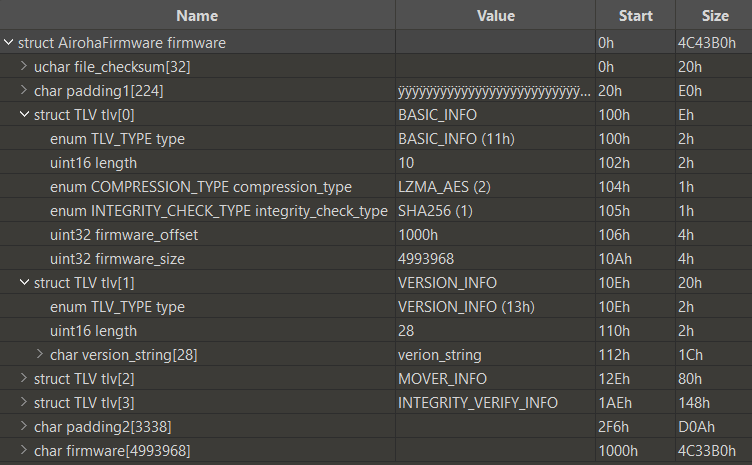

# Airoha firmware parser & decryptor

An _010 Editor_ template for parsing the Airoha firmware format, and a Python script for decrypting the firmware's encrypted part.

Products using this firmware format include the AirReps (an AirPods clone) and numerous Sony headphones (notably WH-1000XM4 and WH-1000XM5, whose MediaTek chips are rebranded Airoha chips. Additional models may be found in [this](https://github.com/lzghzr/MDR_Proxy) repository).

The only plaintext strings present in the firmware are "verion_string" (Sony) and "version_string" (AirReps).

## Parser usage

Simply load the template in 010 Editor and run it on your firmware file.



To produce the parser I've analyzed most firmware fields by hand, until I've found out that an Airoha evaluation kit is [publicly available](https://github.com/haltsai/Airoha_AB1565EVK) and used it to complete the analysis.

## Decryptor usage

To decrypt and decompress an Airoha firmware package, run:

```bash
cd decryptor
pip install -Ur requirements.txt

python airoha_decrypt.py --key=000102030405060708090a0b0c0d0e0f --iv=62633636633839306334636432383763 --from=fw.encrypted --to=fw.decrypted
```

Additional flags include:
 - `--no-decompress`: Do not decompress after decryption.  
   Note that LZMA decompression should fail if you've provided the wrong key/IV.
 - `--reverse-key-and-iv`: A convenience flag for reversing the bytes in the key and in the IV.

For the full list, run `python airoha_decrypt.py -h`.